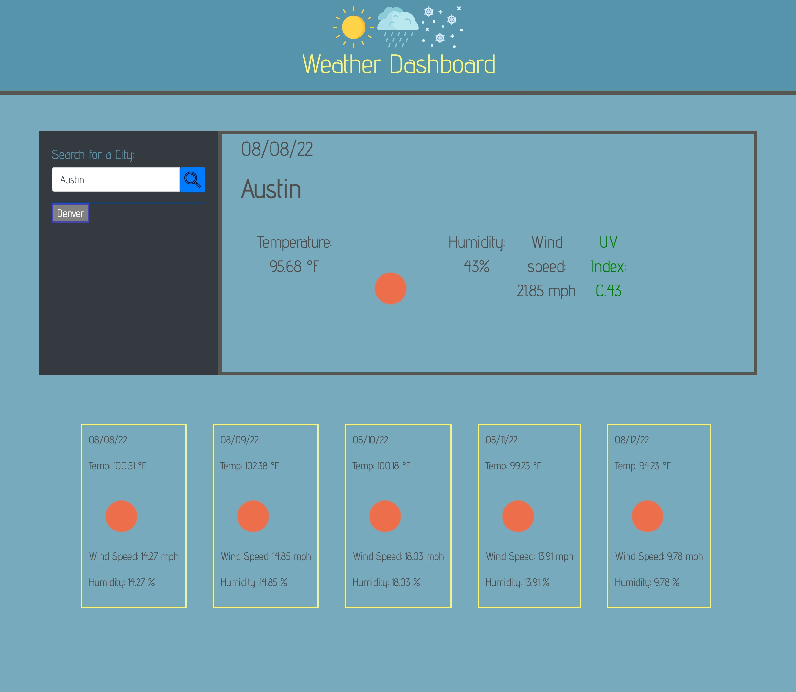

# Weather Dashboard

## Description

This purpose of this project is to create a weather dashboard for users to search a city for the most up-to-date weather information. The third-party API, "Open Weather" allows for access to their data and functionality by making requests with specific parameters to a URL. This weather dashboard runs also features dynamically updated HTML and CSS.

## Features
- Search by city through form inputs
- City name, the date, an icon representation of weather conditions, the temperature, the humidity, the wind speed, and the UV index
- UV index background color that indicates whether the conditions are favorable, moderate, or severe
- A 5-day forecast that displays the date, an icon representation of weather conditions, the temperature, the wind speed, and the humidity
- Search history that when clicked, the user is presented with current and future conditions for that city

## Mock-Up

## Application link

https://thaling11.github.io/weather-dashboard/
